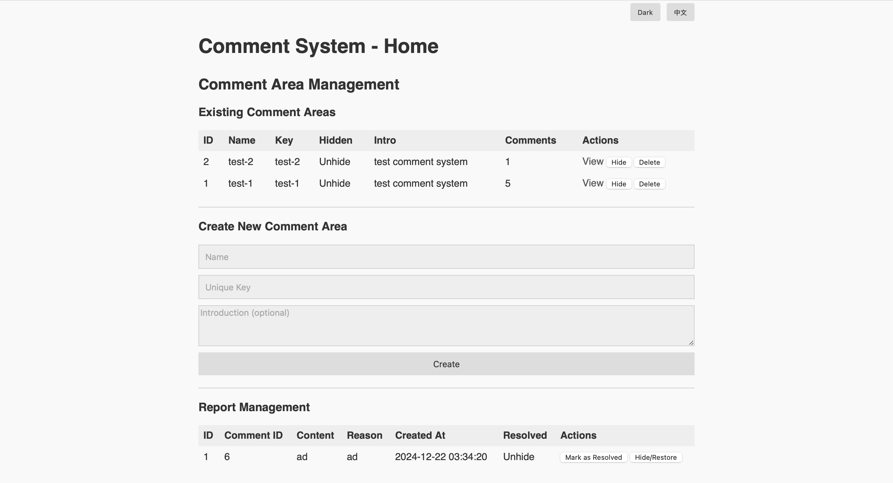
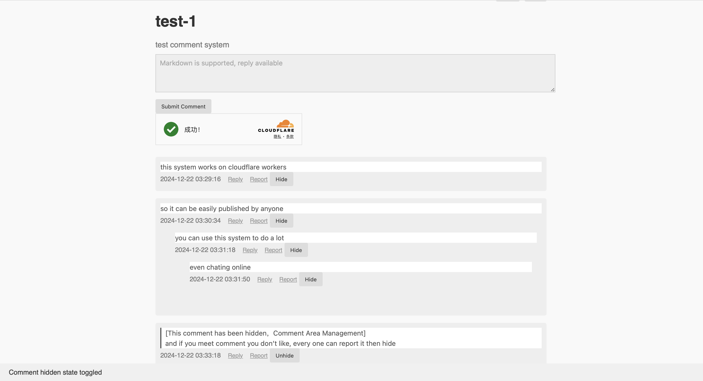

# cf-comments-mixing
a comment woker with only one file (easy use





```
CREATE TABLE IF NOT EXISTS comment_areas (
  id INTEGER PRIMARY KEY AUTOINCREMENT,
  name TEXT NOT NULL,
  area_key TEXT NOT NULL UNIQUE,
  intro TEXT,
  hidden INTEGER NOT NULL DEFAULT 0
);

CREATE TABLE IF NOT EXISTS comments (
  id INTEGER PRIMARY KEY AUTOINCREMENT,
  area_key TEXT NOT NULL,
  content TEXT NOT NULL,
  parent_id INTEGER NOT NULL DEFAULT 0,
  created_at DATETIME DEFAULT CURRENT_TIMESTAMP,
  hidden INTEGER NOT NULL DEFAULT 0,
  FOREIGN KEY (area_key) REFERENCES comment_areas(area_key)
);

CREATE TABLE IF NOT EXISTS reports (
  id INTEGER PRIMARY KEY AUTOINCREMENT,
  comment_id INTEGER NOT NULL,
  reason TEXT NOT NULL,
  created_at DATETIME DEFAULT CURRENT_TIMESTAMP,
  resolved INTEGER NOT NULL DEFAULT 0,
  FOREIGN KEY (comment_id) REFERENCES comments(id)
);
```
